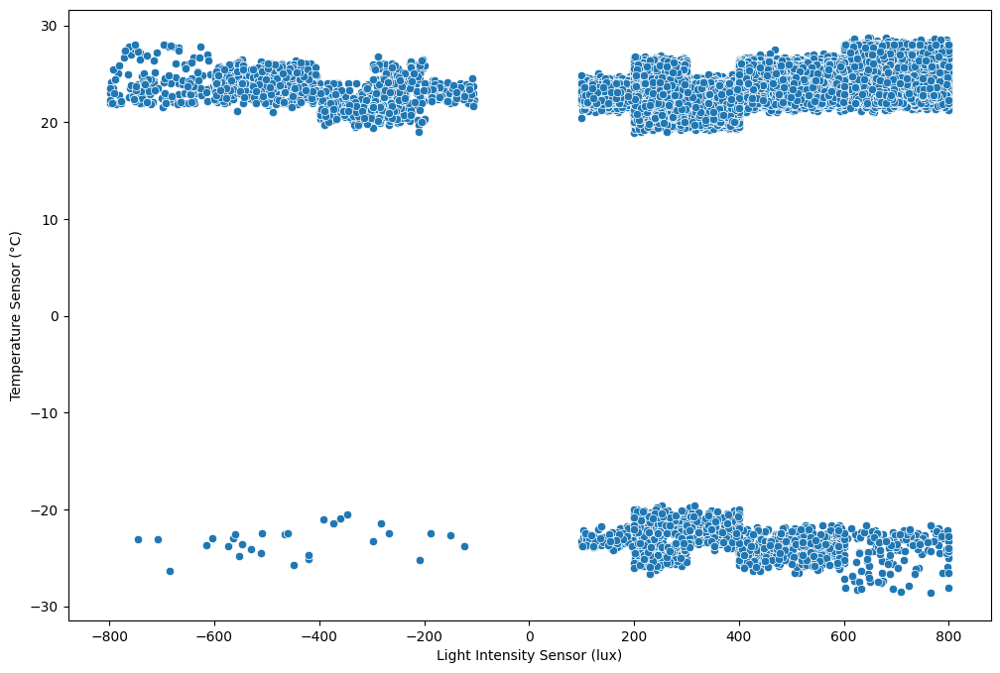
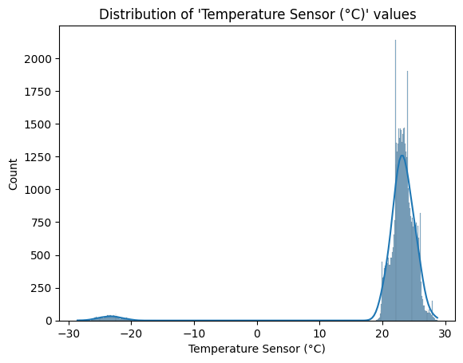
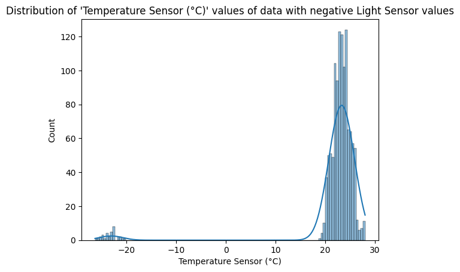
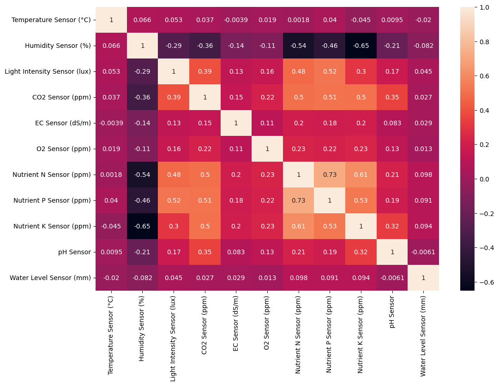

# Student Performance Prediction ML Pipeline
**Name:** ER Qi Yang  
**NRIC:** S9942227J  
**Email:** e0148703@u.nus.edu 

This machine learning pipeline predicts the temperature conditions ("Temperature Sensor (°C)") within the farm's closed environment, ensuring optimal plant growth. Additionally, it contains models to categorise the combined ("Plant Type-Stage") based on sensor data, aiding in
strategic planning and resource allocation.

---

## 📋 Project Overview

This project implements an end-to-end machine learning pipeline with the following stages:

1. **Data Loading**: Load raw data from CSV files or databases.
2. **Data Cleaning**: Handle missing values, duplicates, and outliers.
3. **Data Preprocessing**: Encode categorical variables, normalize numerical features, and handle imbalanced datasets.
4. **Feature Engineering**: Generate new features such as interaction terms and indices.
5. **Model Training**: Train multiple ML models with hyperparameter tuning.
6. **Model Evaluation**: Evaluate models using metrics like RMSE, MAE, and R².
7. **Model Selection**: Select the best-performing model based on evaluation metrics.
8. **Prediction**: Generate predictions on unseen data.

---

## 📊 Dataset Features

The dataset includes the following features:

### Categorical Features
- **System Location Code**: Location of the system (e.g., Zone_A, Zone_B).
- **Previous Cycle Plant Type**: Plant type from the previous cycle.
- **Plant Type**: Current plant type (e.g., Fruiting Vegetables, Leafy Greens).
- **Plant Stage**: Growth stage of the plant (e.g., maturity, seedling).

### Numerical Features
- **Temperature Sensor (°C)**: Temperature readings from sensors.
- **Humidity Sensor (%)**: Humidity levels recorded by sensors.
- **Light Intensity Sensor (lux)**: Light intensity measured in lux.
- **CO2 Sensor (ppm)**: Carbon dioxide levels in parts per million.
- **EC Sensor (dS/m)**: Electrical conductivity of the soil or water.
- **O2 Sensor (ppm)**: Oxygen levels in parts per million.
- **Nutrient N Sensor (ppm)**: Nitrogen levels in parts per million.
- **Nutrient P Sensor (ppm)**: Phosphorus levels in parts per million.
- **Nutrient K Sensor (ppm)**: Potassium levels in parts per million.
- **pH Sensor**: pH levels of the soil or water.
- **Water Level Sensor (mm)**: Water levels measured in millimeters.

## 🔭 Exploratory Data Analysis

From our EDA we found that the input dataset was not clean. The first impressions of the data is that it contains:
- **ppm Sensor in string format**: Sensor readings are in string format and some strings containt spaces and the letters 'ppm'
- **Plant Type and Plant Stage contain uppercase and lowercase letters** : Although the format of the words are the same apart from capitalisation so we can simply make all labels lowercase or uppercase
- **Negative Values**: The Temperature and O2 sensor values contain negative values in them. Upon visualizing a scatter plot we can see that the data is quite symetrical. We can conclude that negative features do not have any intercorrelation.

   - Upon further analysis we find that the distribution of these negative values are not different compared to the rest of the dataset. We can choose to take the absolute value of these negative values or simply delete them as they do not make up a significant portion of the dataset.
   
   
   
- **Heatmap**: Upon plotting the heatmap of the data after cleaning the dataset by amending the beforementioned errors, we get a heatmap that looks like this. We see straight away that Nutrient P and N have high correlation of more than 0.7. We can create new features that combine these 2, for example Nutrient Balance index (refer to Preprocessing Configuration below)


- **Duplicates**: We find that there is a significant number of 7489 duplicates out of the original 57489 which we delete from the data set.

- **Null values**: Next we take a look at the null values before doing a preprocessing on the clean data which include techniques such as imputation, scaling, and creating new features.

| Feature                           | Missing Values |
|-----------------------------------|----------------|
| System Location Code              | 0              |
| Previous Cycle Plant Type         | 0              |
| Plant Type                         | 0              |
| Plant Stage                        | 0              |
| Temperature Sensor (°C)           | 8689           |
| Humidity Sensor (%)              | 38867          |
| Light Intensity Sensor (lux)      | 4278           |
| CO2 Sensor (ppm)                  | 0              |
| EC Sensor (dS/m)                  | 0              |
| O2 Sensor (ppm)                   | 0              |
| Nutrient N Sensor (ppm)          | 9974           |
| Nutrient P Sensor (ppm)          | 5698           |
| Nutrient K Sensor (ppm)          | 3701           |
| pH Sensor                          | 0              |
| Water Level Sensor (mm)          | 8642           |


---

## ⚙️ Configuration

The pipeline is highly configurable through YAML files located in the `config/` directory. The user can choose to enable or not the different parameters :

### Preprocessing Configuration (`preprocessing_config.yaml`)
- **Missing Value Handling**: Strategies include mean, median, or mode imputation.
- **Categorical Encoding**: Options include one-hot encoding, label encoding, and frequency encoding.
- **Scaling**: Normalize numerical features using StandardScaler, MinMaxScaler, or RobustScaler.
- **Outlier Handling**: Options include IQR-based filtering or Z-score thresholds.
- **Feature Engineering**:
  - **Nutrient Balance Index**: Combines nitrogen, phosphorus, and potassium levels.
  - **Environmental Stress Index**: Derived from temperature, humidity, light intensity, CO2, and O2 levels.
  - **Water Quality Score**: Combines pH, EC, and water level measurements.

### Model Configuration (`model_config.yaml`)
- **Algorithms**: Includes Random Forest, XGBoost, LightGBM, and ElasticNet. A Multi Layer Perceptron and Ensemble model is also used for regression and classification respectively.
- **Hyperparameters**: Configurable for grid search or random search.

### General Configuration (`config.yaml`)
- **Data Paths**: Paths for raw, processed, and feature-engineered data.
- **Logging**: Configurable logging levels and output formats.
- **Experiment Tracking**: Save metrics, models, and visualizations for analysis.

---
## 🧹 Data Cleaning and Processing procedure

### Below are the clases defined to handle cleaning, selection of features, engineering of feautres and processing of features respectively.

| **Class**        | **Actions**                                                                 |
|-------------------|-----------------------------------------------------------------------------|
| **DataCleaner**    | - Nutrient Sensor values are extracted from strings and converted to float. |
|                   | - Plant Type and Plant Stage labels are lower-cased.                         |
|                   | - Convert negative values to positive in sensor readings (O2 and Temperature).|
|                   | - Delete duplicates.                                                         |
|                   | - Impute missing values according to mode.                                  |
|                   | - Handle outliers using IQR.                                                |
| **FeatureSelector**| - Create new target feature called Plant Type-Stage for the classification problem.|
|                   | - Select features via variances, correlation, or importance.                |
| **FeatureEngineer**| - Create additional features: Nutrient Balance Index, Environmental Stress Index, and Water Quality Score to enhance dataset.|
| **FeatureProcessor**| - Drop columns manually by user.                                           |
|                   | - Encode categorical data by one-hot encoding (or label encoder according to configuration).|
|                   | - Scale numerical data.                                                     |

___

## ⚙️ Installation

### Prerequisites
- Python 3.8 or higher
- pip (Python package installer)

### Setup
1. Clone this repository:
   ```bash
   git clone https://github.com/theopenguino99/aiip5-Er-Qi-Yang-227J.git
   cd aiip5-Er-Qi-Yang-227J
   ```

2. Install the required packages:
   ```bash
   pip install -r requirements.txt
   ```

---

## 🚀 Usage

### Running the Pipeline
To run the entire ML pipeline with the default configuration:
```bash
./run.sh
```
---

## 🛠️ Customization

### Adding New Models
1. Update the `model_config.yaml` file with the new model's parameters.
2. The pipeline will automatically include it in the training and evaluation process.

### Feature Engineering
1. Modify the `preprocessing_config.yaml` file to add new transformations.
2. Implement custom transformations in `src/features/feature_engineering.py`.

---

## 📂 Project Structure

```
student_performance_ml_pipeline/
├── README.md                               # Project documentation
├── requirements.txt                        # Dependencies
├── run.sh                                  # Script to run the pipeline
├── eda.ipynb                               # Notebook for Exploratory Data Analysis
├── config/                                 # Configuration files
│   ├── config.yaml                         # General pipeline configuration
│   ├── preprocessing_config.yaml           # Preprocessing configuration
│   └── model_config.yaml                   # Model-specific configurations
├── data/                                   # Data directory
│   ├── agri.db                             # Raw data (Removed from github according to assessment guidelines)
│   └── processed/                          # Processed data
├── models/                                 # Saved models (in .pkl format)
├── results/                                # Results and visualizations (in both .pkl and .csv readable format)
├── src/                                    # Source code
    ├── config_loader.py                    # Module for loading configurations from .yaml files
    ├── data_loader.py                      # Module for loading data
    ├── data_cleaner.py                     # Module for cleaning data
    ├── data_preprocessor.py                # Module for preprocessing data
    ├── feature_engineering.py              # Module for feature engineering
    ├── feature_selection.py                # Module for feature selection (automatic)
    ├── model_trainer.py                    # Module for training chosen models
    ├── model_evaluator.py                  # Module for evaluating performance of models
    ├── temperature_regression_models.py    # Module for regression models
    ├── plant_type_stage_classification.py  # Module for classification models
    └── main.py                             # Main module to execute
```
---

## 📈 Results

The pipeline outputs evaluation metrics and predictions in the `results/` directory. Key metrics include:
### For Regression:
- **RMSE**: Root Mean Squared Error
   - RMSE is used to measure the magnitude of error between predicted and actual values. It is especially useful when we care more about larger errors. Since it squares the errors, it gives more weight to large errors, making it particularly sensitive to outliers.
- **MSE**: Mean Squared Error
   - MSE is similar to RMSE with the exception of being the squared version, thus large errors tend to be penalised more.
- **MAE**: Mean Absolute Error
   - MAE is a straightforward and interpretable metric, representing the average error in absolute terms. It gives an equal weight to all errors, regardless of their size, which makes it less sensitive to outliers compared to RMSE. This can be useful when we want to understand the overall accuracy of the model without overly penalizing large errors.
- **R²**: Coefficient of Determination
   - R² tells us how much of the variance in the dependent variable is explained by the model, ranging from 0 to 1, with higher values indicating a better fit. A value of 1 means the model perfectly explains the variance in the data, while 0 means the model doesn't explain any variance. R² is useful to understand how well the model is performing relative to a simple baseline (e.g., predicting the mean value for all instances).
### For Classification
- **Accuracy**:
   - Accuracy gives a quick, general idea of how well the model is performing. It is often used when the classes are balanced. However, accuracy might be misleading when dealing with imbalanced datasets, where one class dominates the other.
- **Precision**:
   - Precision helps to understand how many of the predicted positive instances were actually true positives. It is useful when the cost of false positives is high (e.g., predicting a plant is in the wrong stage, which may lead to wrong actions).
- **Recall**:
   - Recall tells us how many of the actual positive instances the model was able to identify. It is especially important when false negatives are costly (e.g., missing a plant's growth stage could result in poor decision-making or resource allocation).
- **F1**:
   - The F1-Score is particularly useful when you have an imbalanced dataset or when the cost of false positives and false negatives is not the same. It provides a balance between precision and recall, helping to evaluate the model when both false positives and false negatives need to be minimized.

Visualizations are also generated to help interpret the results.

---

## 🤝 Contributing

1. Fork the repository.
2. Create a feature branch:
   ```bash
   git checkout -b feature/your-feature
   ```
3. Commit your changes:
   ```bash
   git commit -m 'Add some feature'
   ```
4. Push to the branch:
   ```bash
   git push origin feature/your-feature
   ```
5. Open a Pull Request.

---

